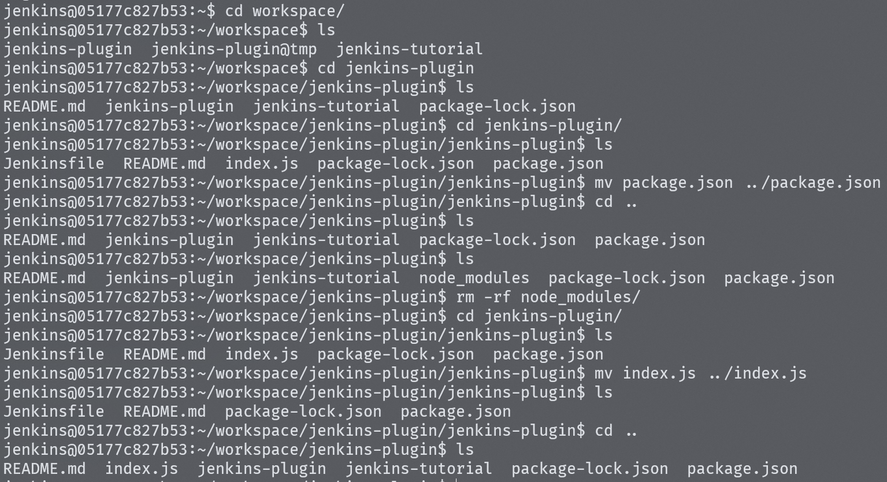

# 젠킨스 플러그인 설치

- Jenkins 관리 -> Plugin Manager에서 Available plugins 중 NodeJS 플러그인을 설치합니다.

- 플러그인을 사용하기 위해서는 Global Tool Configuration에서 NodeJS에 대한 플러그인을 등록해야 합니다. 이 과정은 젠킨스에 환경변수를 등록하는 것과 같습니다.

- nodejs 환경변수를 등록하고 이전의 파이프라인 구축 튜토리얼과 마찬가지로 젠킨스 파일을 작성하고 NodeJS 플러그인에서 제공하는 스크립트를 사용해서 `npm install`과 `npm run start`를 빌드 단계에 실행되도록 합니다.

# 트러블 슈팅

- 처음 빌드 과정에서 생긴 에러는 실행중인 젠킨스 컨테이너가 package.json을 찾지 못해 `npm install`을 수행하지 못하는 것이였다.

- `docker exec -it`를 사용해 젠킨스 컨테이너 내부에 접근해 workspace에 디렉토리를 확인했다.

- jenkins-plugin-nodejs의 젠킨스파일의 위치에 package.json이 존재하지 않았고 같은 경로에 위치하도록 했다.

- 

- 하지만 이번엔 build가 되지 않았고 단순히 하나의 js 파일을 실행시키도록 `npm run start`로 변경해서 빌드해봤지만 빌드에 대한 내용이 아니여서인지 또 에러가 발생했다. 이 부분의 원인은 크게 고민하지 않고 넘어갔다.

- 그래서 `npm run build` 명령어가 필요한 리액트앱을 생성해서 리액트앱의 빌드를 젠킨스를 통해 하기로 했다.

- 이번엔 build에 대한 스크립트를 찾지 못하는 에러가 발생했고 빌드를 webpack을 사용하도록 webpack을 설치해서 다시 시도하고 react-script를 설치해서 의존성에 추가해 `npm install` 단계에서 설치되어서 빌드에 사용되도록 했지만 모두 실패했다.

## 추측

- 젠킨스 컨테이너의 workspace 내부에 디렉토리와 파일들이 서로 엉켜있었는데 현재 레포지토리는 두개의 젠킨스 파일을 가지고 두개의 파이프라인을 구성했다.

- 만약 이것이 원인이라면 플러그인을 사용하는 node.js 빌드 테스트 파이프라인을 새로운 레포지토리에 push해서 다시 시도했을 때 문제없이 될 것이다.

- 추측이 맞았고 새로운 레포지토리에 리액트앱을 생성해 파이프라인을 구축해서 테스트한 결과 에러가 발생하지 않았다.

- ```
    Started by user boo0
  Obtained Jenkinsfile from git https://github.com/BOOOO0/react-jenkins-test
  [Pipeline] Start of Pipeline
  [Pipeline] node
  Running on Jenkins in /var/jenkins_home/workspace/nodejs-test
  [Pipeline] {
  [Pipeline] stage
  [Pipeline] { (Declarative: Checkout SCM)
  [Pipeline] checkout
  Selected Git installation does not exist. Using Default
  The recommended git tool is: NONE
  No credentials specified
  Cloning the remote Git repository
  Cloning repository https://github.com/BOOOO0/react-jenkins-test
   > git init /var/jenkins_home/workspace/nodejs-test # timeout=10
  Fetching upstream changes from https://github.com/BOOOO0/react-jenkins-test
   > git --version # timeout=10
   > git --version # 'git version 2.30.2'
   > git fetch --tags --force --progress -- https://github.com/BOOOO0/react-jenkins-test +refs/heads/*:refs/remotes/origin/* # timeout=10
   > git config remote.origin.url https://github.com/BOOOO0/react-jenkins-test # timeout=10
   > git config --add remote.origin.fetch +refs/heads/*:refs/remotes/origin/* # timeout=10
  Avoid second fetch
   > git rev-parse refs/remotes/origin/main^{commit} # timeout=10
  Checking out Revision aa10035693539a0fefc6b9e19a32e484b51b02bb (refs/remotes/origin/main)
   > git config core.sparsecheckout # timeout=10
   > git checkout -f aa10035693539a0fefc6b9e19a32e484b51b02bb # timeout=10
  Commit message: "feat: create react app"
  First time build. Skipping changelog.
  [Pipeline] }
  [Pipeline] // stage
  [Pipeline] withEnv
  [Pipeline] {
  [Pipeline] stage
  [Pipeline] { (Build)
  [Pipeline] nodejs
  [Pipeline] {
  [Pipeline] sh
  ```

```
  npm install
  npm WARN old lockfile
  npm WARN old lockfile The package-lock.json file was created with an old version of npm,
  npm WARN old lockfile so supplemental metadata must be fetched from the registry.
  npm WARN old lockfile
  npm WARN old lockfile This is a one-time fix-up, please be patient...
  npm WARN old lockfile
  npm WARN EBADENGINE Unsupported engine {
  npm WARN EBADENGINE package: '@csstools/selector-specificity@2.2.0',
  npm WARN EBADENGINE required: { node: '^14 || ^16 || >=18' },
  npm WARN EBADENGINE current: { node: 'v17.9.1', npm: '8.11.0' }
  npm WARN EBADENGINE }
  npm WARN EBADENGINE Unsupported engine {
  npm WARN EBADENGINE package: '@jest/expect-utils@29.5.0',
  npm WARN EBADENGINE required: { node: '^14.15.0 || ^16.10.0 || >=18.0.0' },
  npm WARN EBADENGINE current: { node: 'v17.9.1', npm: '8.11.0' }
  npm WARN EBADENGINE }
  npm WARN EBADENGINE Unsupported engine {
  npm WARN EBADENGINE package: 'jest-get-type@29.4.3',
  npm WARN EBADENGINE required: { node: '^14.15.0 || ^16.10.0 || >=18.0.0' },
  npm WARN EBADENGINE current: { node: 'v17.9.1', npm: '8.11.0' }
  npm WARN EBADENGINE }
  npm WARN EBADENGINE Unsupported engine {
  npm WARN EBADENGINE package: '@jest/schemas@29.4.3',
  npm WARN EBADENGINE required: { node: '^14.15.0 || ^16.10.0 || >=18.0.0' },
  npm WARN EBADENGINE current: { node: 'v17.9.1', npm: '8.11.0' }
  npm WARN EBADENGINE }
  npm WARN EBADENGINE Unsupported engine {
  npm WARN EBADENGINE package: '@jest/types@29.5.0',
  npm WARN EBADENGINE required: { node: '^14.15.0 || ^16.10.0 || >=18.0.0' },
  npm WARN EBADENGINE current: { node: 'v17.9.1', npm: '8.11.0' }
  npm WARN EBADENGINE }
  npm WARN EBADENGINE Unsupported engine {
  npm WARN EBADENGINE package: 'diff-sequences@29.4.3',
  npm WARN EBADENGINE required: { node: '^14.15.0 || ^16.10.0 || >=18.0.0' },
  npm WARN EBADENGINE current: { node: 'v17.9.1', npm: '8.11.0' }
  npm WARN EBADENGINE }
  npm WARN EBADENGINE Unsupported engine {
  npm WARN EBADENGINE package: 'expect@29.5.0',
  npm WARN EBADENGINE required: { node: '^14.15.0 || ^16.10.0 || >=18.0.0' },
  npm WARN EBADENGINE current: { node: 'v17.9.1', npm: '8.11.0' }
  npm WARN EBADENGINE }
  npm WARN EBADENGINE Unsupported engine {
  npm WARN EBADENGINE package: 'jest-diff@29.5.0',
  npm WARN EBADENGINE required: { node: '^14.15.0 || ^16.10.0 || >=18.0.0' },
  npm WARN EBADENGINE current: { node: 'v17.9.1', npm: '8.11.0' }
  npm WARN EBADENGINE }
  npm WARN EBADENGINE Unsupported engine {
  npm WARN EBADENGINE package: 'jest-get-type@29.4.3',
  npm WARN EBADENGINE required: { node: '^14.15.0 || ^16.10.0 || >=18.0.0' },
  npm WARN EBADENGINE current: { node: 'v17.9.1', npm: '8.11.0' }
  npm WARN EBADENGINE }
  npm WARN EBADENGINE Unsupported engine {
  npm WARN EBADENGINE package: 'jest-matcher-utils@29.5.0',
  npm WARN EBADENGINE required: { node: '^14.15.0 || ^16.10.0 || >=18.0.0' },
  npm WARN EBADENGINE current: { node: 'v17.9.1', npm: '8.11.0' }
  npm WARN EBADENGINE }
  npm WARN EBADENGINE Unsupported engine {
  npm WARN EBADENGINE package: 'jest-message-util@29.5.0',
  npm WARN EBADENGINE required: { node: '^14.15.0 || ^16.10.0 || >=18.0.0' },
  npm WARN EBADENGINE current: { node: 'v17.9.1', npm: '8.11.0' }
  npm WARN EBADENGINE }
  npm WARN EBADENGINE Unsupported engine {
  npm WARN EBADENGINE package: 'jest-util@29.5.0',
  npm WARN EBADENGINE required: { node: '^14.15.0 || ^16.10.0 || >=18.0.0' },
  npm WARN EBADENGINE current: { node: 'v17.9.1', npm: '8.11.0' }
  npm WARN EBADENGINE }
  npm WARN EBADENGINE Unsupported engine {
  npm WARN EBADENGINE package: 'pretty-format@29.5.0',
  npm WARN EBADENGINE required: { node: '^14.15.0 || ^16.10.0 || >=18.0.0' },
  npm WARN EBADENGINE current: { node: 'v17.9.1', npm: '8.11.0' }
  npm WARN EBADENGINE }
  npm WARN deprecated w3c-hr-time@1.0.2: Use your platform's native performance.now() and performance.timeOrigin.
  npm WARN deprecated stable@0.1.8: Modern JS already guarantees Array#sort() is a stable sort, so this library is deprecated. See the compatibility table on MDN: https://developer.mozilla.org/en-US/docs/Web/JavaScript/Reference/Global_Objects/Array/sort#browser_compatibility
  npm WARN deprecated sourcemap-codec@1.4.8: Please use @jridgewell/sourcemap-codec instead
  npm WARN deprecated rollup-plugin-terser@7.0.2: This package has been deprecated and is no longer maintained. Please use @rollup/plugin-terser
  npm WARN deprecated svgo@1.3.2: This SVGO version is no longer supported. Upgrade to v2.x.x.

```

added 1490 packages, and audited 1491 packages in 42s

233 packages are looking for funding
run `npm fund` for details

6 high severity vulnerabilities

To address all issues (including breaking changes), run:
npm audit fix --force

Run `npm audit` for details.
[Pipeline] sh

- npm run build

> react-app@0.1.0 build
> react-scripts build

Creating an optimized production build...
Compiled successfully.

File sizes after gzip:

46.61 kB build/static/js/main.03fee2c2.js
1.78 kB build/static/js/787.b701888c.chunk.js
541 B build/static/css/main.073c9b0a.css

The project was built assuming it is hosted at /.
You can control this with the homepage field in your package.json.

The build folder is ready to be deployed.
You may serve it with a static server:

npm install -g serve
serve -s build

Find out more about deployment here:

https://cra.link/deployment

[Pipeline] }
[Pipeline] // nodejs
[Pipeline] }
[Pipeline] // stage
[Pipeline] stage
[Pipeline] { (Deploy)
[Pipeline] echo
This is the first step in the Deploy Stage
[Pipeline] }
[Pipeline] // stage
[Pipeline] }
[Pipeline] // withEnv
[Pipeline] }
[Pipeline] // node
[Pipeline] End of Pipeline
Finished: SUCCESS

```

```
